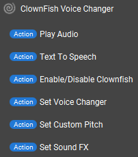
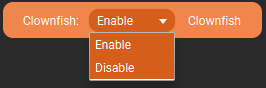
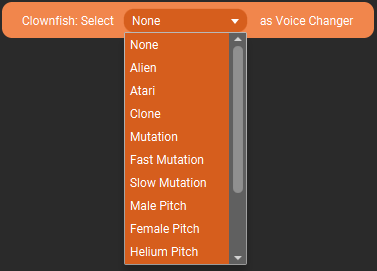
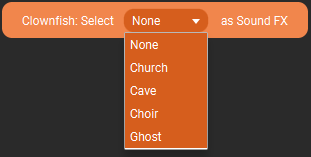
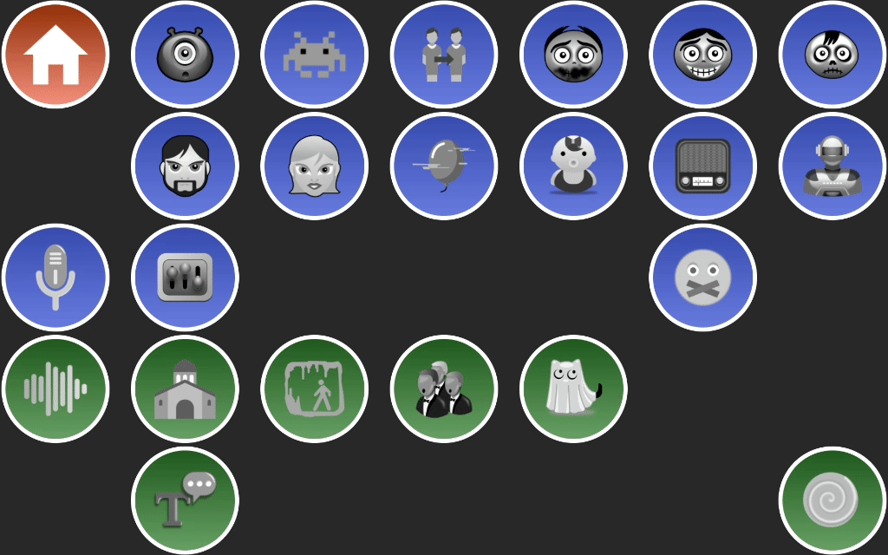

# Touch Portal Clownfish Voice Changer Plugin


- [Touch Portal Clownfish Voice Changer Plugin](#touch-portal-clownfish-voice-changer-plugin)
  - [Changelog](#changelog)
  - [Description](#description)
  - [Install](#install)
  - [Actions](#actions)
    - [Play Audio](#play-audio)
    - [Text To Speech](#text-to-speech)
    - [Enable/Disable Clownfish](#enabledisable-clownfish)
    - [Set Voice Changer](#set-voice-changer)
    - [Set Custom Pitch](#set-custom-pitch)
    - [Set Sound FX](#set-sound-fx)
  - [States](#states)
    - [Clownfish Voice Selected](#clownfish-voice-selected)
    - [Clownfish Sound FX Selected](#clownfish-sound-fx-selected)
  - [Example Page](#example-page)
  - [Issues](#issues)
  - [Author](#author)
  - [License](#license)

## Changelog
```
1.0.0 - The initial release
    - Actions
        - Play Audio - Choose a sound to play through Clownfish
        - Text To Speech - Send text to be spoken by Clownfish (Tested only with built in windows voices)
        - Enable/Disable Clownfish - Turn on or Off Clownfish
        - Set Voice Changer - Set your Voice Change effect (or set to None to turn off)
        - Set Custom Pitch - Set a Custom Pitch between -15.0 and 15.0
        - Set Sound FX - Set your Sound FX (or set to None to turn off)
    - States
      Note: These states will only be updated when an action from this plugin fires, and not if changed directly in Clownfish
        - Clownfish Voice Selected - will be one of the following: None, Alien, Atari, Clone, Mutation, Fast Mutation, Slow Mutation, Male Pitch, Female Pitch, Helium Pitch, Baby Pitch, Radio, Robot, Custom Picth, Silence
        - Clownfish Sound FX Selected - will be one of the following: None, Church, Cave, Choir, Ghost
    - Events
        None
1.1.0 -
    - Enhancements
      - Using new Node.JS Build script for packaging the plugin
      - Adding in VST control actions
        - Set VST
        - Disable VST
        - Open VST Configuration
    - Bug Fixes
      - Corrected "Custom Picth" misspelling to "Custom Pitch" in the state "clownfish_voice_selected"
```

## Description
If you use Clownfish VoiceChanger this plugin will allow you to change the configuration using Touch Portal! 
Do you want Text-To-Speech on Windows for FREE, this plugin will do that for you as well.

The downside is there is NO communication back from Clownfish so, it will not be able to stay in sync if you interact directly through Clownfish.  This is a limitation of the API itself and not something that I can fix with the plugin.

## Install

1. Make sure that Clownfish is already started (https://clownfish-translator.com/voicechanger/)
2. Import the .tpp file into Touch Portal
3. Click Okay and Trust Always
4. Import the sample page if you want

## Actions



### Play Audio

Play an audio file through Clownfish and it's default outbound device (good for playing direct through microphone)


### Text To Speech

Send text you want spoken out to your users and it's default outbound device (good for playing direct through microphone)


### Enable/Disable Clownfish

Just as the action says, Enable or Disable Clownfish



### Set Voice Changer

Set your selected voice changer option or unset it



### Set Custom Pitch

Set your voice changer to a custom pitch. Allowed values are -15.0 and 15.0


### Set Sound FX

Set Sound FX to add on top of your voice change or not.



## States

### Clownfish Voice Selected

**Valid Values**: None, Alien, Atari, Clone, Mutation, Fast Mutation, Slow Mutation, Male Pitch, Female Pitch, Helium Pitch, Baby Pitch, Radio, Robot, Custom Picth, Silence
### Clownfish Sound FX Selected

**Valid Values**: None, Church, Cave, Choir, Ghost

## Example Page

[Download](resources/Clownfish-VC-Example.tpz)

*Note: This page uses the Edge Graphics Upgrade which is an additional purchase from Touch Portal, if you don't have it, the icons and gradient backgrounds will still display but the white circle edge will not.*



## Issues
Please report issues on the github Issues tab, or in the #clownfish channel on the Official Touch Portal Discord.

## Author
Jameson Allen (aka Spdermn02)

## License
MIT see the [LICENSE](LICENSE) file